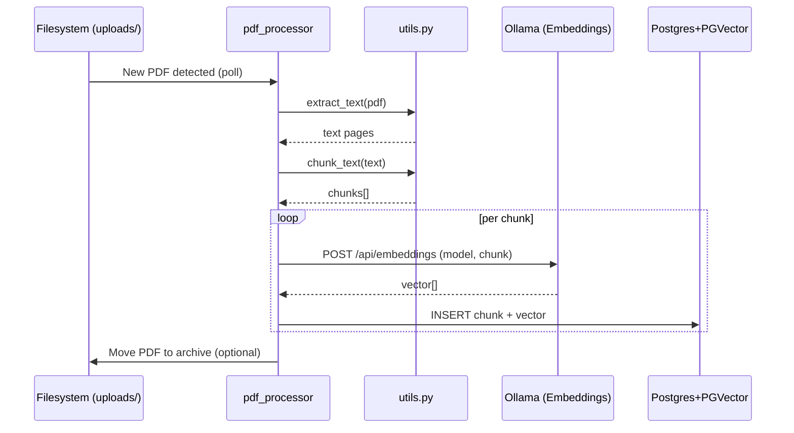
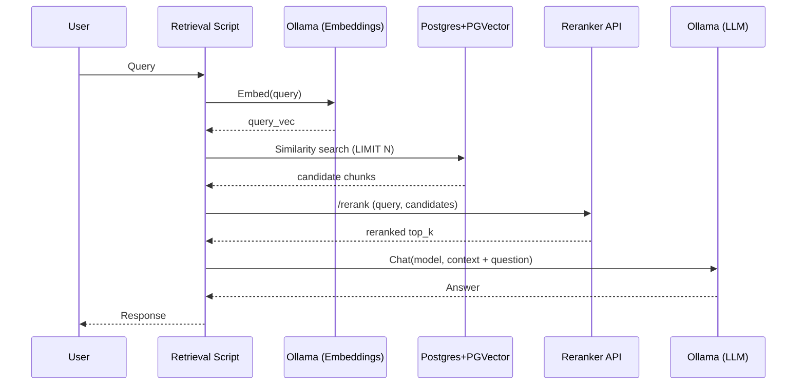
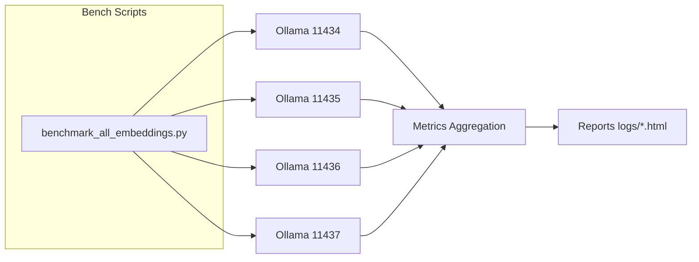

# Diagrams

Visual aids for understanding ingestion, retrieval, and reranking sequences. Render Mermaid locally (many IDEs/extensions support it) or convert to images for external docs.

## Ingestion (Worker Mode)


## Retrieval + Rerank + Answer


## Benchmarking Multiple Embedding Models


---
Add more diagrams as new components (e.g., hybrid search, caching, OCR layer) are introduced.

## Evaluation Metrics Flow
```mermaid
flowchart LR
  Q[Queries + Relevance Spec] --> E[eval_suite.py]
  E -->|Embed queries| O[Ollama]
  E -->|Vector search| DB[(PGVector)]
  DB --> E
  E --> M[Metrics JSON]
  M --> R[(Recall@K\\nMRR\\nnDCG)]
```
