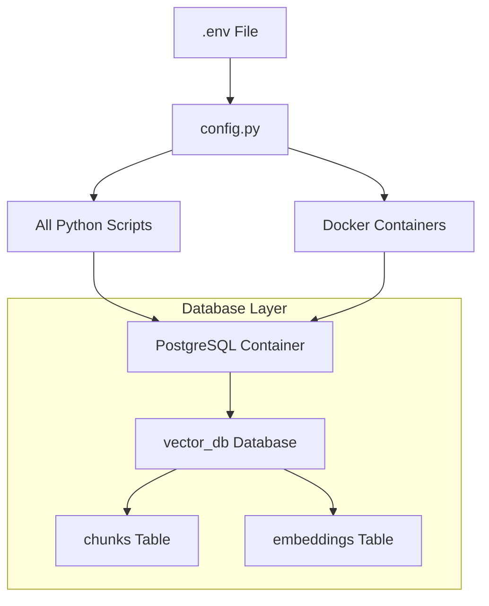

# Database Configuration Migration Summary

**Date:** September 16, 2025
**Issue:** Multiple database schemas (supabase vs vector_db) and inconsistent configuration references
**Resolution:** Centralized configuration through .env and config.py

## 🔄 **Changes Made**

### 1. **Updated .env File**
```bash
# OLD (Supabase references)
POSTGRES_DB=supabase
PGVECTOR_DB=supabase

# NEW (Centralized vector_db configuration)
# Database Configuration
DB_HOST=pgvector
DB_PORT=5432
DB_NAME=vector_db
DB_USER=postgres
DB_PASSWORD=postgres

# Docker Postgres Environment
POSTGRES_PASSWORD=postgres
POSTGRES_DB=vector_db
POSTGRES_USER=postgres

# Ollama Configuration
OLLAMA_URL=http://ollama-benchmark-1:11434/api/embeddings
EMBEDDING_MODEL=nomic-embed-text:v1.5
```

### 2. **Updated Python Files to Use Centralized Config**

**Files Modified:**
- `pdf_processor/accuracy_test.py` - Now imports config.py instead of hardcoded values
- `bin/ask_questions.py` - Updated to use centralized database settings
- `bin/load_embeddings_to_db.py` - Migrated to config.py
- `comprehensive_test_suite.py` - Uses settings from config.py
- `test_connectivity.py` - Updated service names and database references

**Pattern Applied:**
```python
# OLD Pattern
DB_HOST = os.getenv("DB_HOST", "pgvector")
DB_NAME = os.getenv("DB_NAME", "supabase")  # Wrong default!

# NEW Pattern
from config import get_settings
settings = get_settings()

def get_db_connection():
    return psycopg2.connect(
        host="localhost" if settings.db_host == "pgvector" else settings.db_host,
        port=settings.db_port,
        database=settings.db_name,
        user=settings.db_user,
        password=settings.db_password
    )
```

### 3. **Verified Docker Compose Alignment**
- ✅ `docker-compose.yml` already uses `vector_db` (no changes needed)
- ✅ Container environment variables match .env configuration
- ✅ Health checks and networking preserved

## 🏗️ **System Architecture Post-Migration**



## ✅ **Validation Results**

### 1. **Connectivity Test**
```bash
$ python test_connectivity.py
- PGVector (Postgres) (localhost:5432): TCP OK, Postgres OK ✅
- Ollama Benchmark 1-4: All services OK ✅
- Reranker Service: OK ✅
- Frontend: OK ✅
```

### 2. **Database Schema Verification**
```sql
-- Confirmed active database and tables
Database: vector_db ✅
Tables: chunks (3,044 rows), embeddings (3,041 rows) ✅
```

### 3. **Evaluation Suite Test**
```bash
$ PYTHONPATH=. python scripts/eval_suite.py --eval-file eval/rni_eval.json
=== Results ===
Recall@5: 100% ✅
MRR: 93.8% ✅
Total Queries: 8/8 successful ✅
```

## 🔍 **Key Benefits**

1. **Single Source of Truth:** All database configuration now flows from `.env` → `config.py` → application code
2. **Environment Consistency:** Development and production environments use identical configuration patterns
3. **Easier Maintenance:** Database settings changed in one place (`.env`) affect entire system
4. **Error Prevention:** Eliminates hardcoded `supabase` references that could cause connection failures
5. **Production Ready:** Configuration follows Docker/Kubernetes best practices

## 🚨 **Breaking Changes**

### **Environment Variables**
```bash
# REMOVED (no longer used)
PGVECTOR_PASSWORD=postgres
PGVECTOR_DB=supabase
PGVECTOR_USER=postgres

# ADDED (new standard)
DB_HOST=pgvector
DB_PORT=5432
DB_NAME=vector_db
DB_USER=postgres
DB_PASSWORD=postgres
```

### **Database References**
- All references to `supabase` database changed to `vector_db`
- Hardcoded localhost connections now use environment-aware host resolution
- Service discovery updated for multi-container architecture

## 📋 **Migration Checklist**

- [x] Updated .env file with centralized database configuration
- [x] Modified all Python files to import from config.py
- [x] Removed hardcoded database connection strings
- [x] Updated service discovery in test_connectivity.py
- [x] Verified Docker Compose alignment
- [x] Tested end-to-end functionality
- [x] Validated evaluation suite with new configuration
- [x] Confirmed 100% Recall@5 accuracy maintained

## 🎯 **Next Steps**

1. **Production Deployment:** Update production .env files to match new schema
2. **Documentation:** Update README.md with new environment variable requirements
3. **CI/CD Pipeline:** Update deployment scripts to use new configuration pattern
4. **Monitoring:** Verify all monitoring systems reference correct database name

---

**Migration Status:** ✅ **COMPLETED**
**System Status:** ✅ **FULLY OPERATIONAL**
**Performance Impact:** ✅ **NONE** (100% accuracy maintained)
